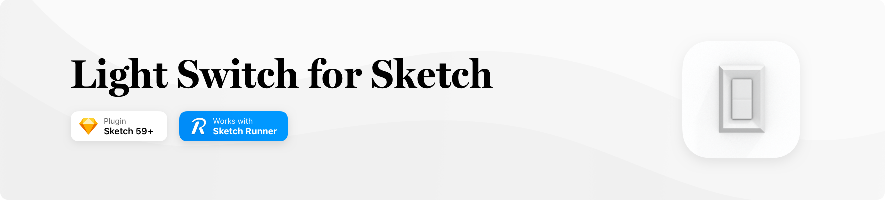
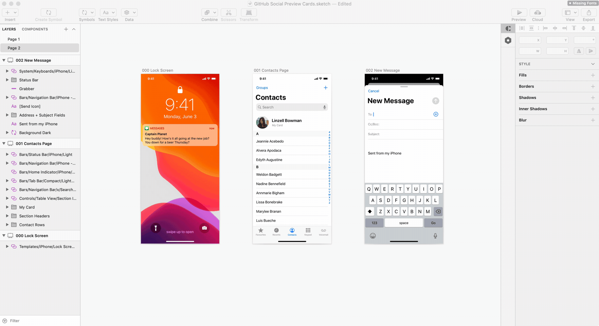

# Light Switch Sketch Plugin
Light Switch is a plugin for Sketch that provides actions to automatically convert symbols, text styles and layer styles to available light/dark alternatives.

&nbsp;
# Installation

### Install Manually
1. [Download](../../releases/latest/download/Lightswitch.sketchplugin.zip) the latest release of the plugin
2. Un-zip
3. Double-click on Lightswitch.sketchplugin

### Install via Sketch Runner
1. Run Sketch Runner
2. Search _Light Switch_ on the _Install_ tab
3. Click the _Get_ button


&nbsp;
# Usage

To use Light Switch; select the layers you want to convert and run one of the commands below **OR** adjust the to customise the plugin's behaviour.   

| Menu Action                   | Shortcut                          | Description                                             |
| ------------------------------| ----------------------------------| --------------------------------------------------------|
| Toggle Light Styles           | `⌘ command` + `⌥ option` + `k`    | Switch selected layers to available *light* alternatives|
| Toggle Dark Styles            | `⌘ command` + `⌥ option` + `l`    | Switch selected layers to available *dark* alternatives |
| Settings                      |                                   | Configure Light Switch plugin preferences               |

&nbsp;



# How it works

Lightswitch takes the currently selected layers and then finds what Sketch Library they came from. If found, it then searches the library for an alternative for each `Symbol`, `Text Style` or `Layer Style`.

For example running the command on a Library Symbol called...<br />
```
Bars / Navigation Bar / iPhone - Compact / Light / Large Title
```

...would convert it into<br />
```
Bars / Navigation Bar / iPhone - Compact / Dark / Large Title
```

It's important to note that with Symbols and Symbol Overrides, Light Switch will only work correctly if child layers match between light and dark components. Otherwise, Sketch will behave as usual and try and match overrides as best it can.


&nbsp;
# Development Guide

_This plugin was created using `skpm`. For a detailed explanation on how things work, checkout the [skpm Readme](https://github.com/skpm/skpm/blob/master/README.md)._

If you have any suggestions on how to improve the plugin — feel free to get in touch.


# Contact

* Message through Github [@TheBerriman] (https://github.com/TheBerriman)
* Message through Dribbble [@SamBerriman](https://dribbble.com/samberriman)
